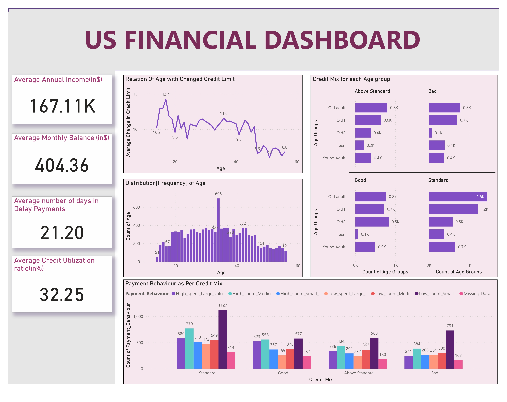
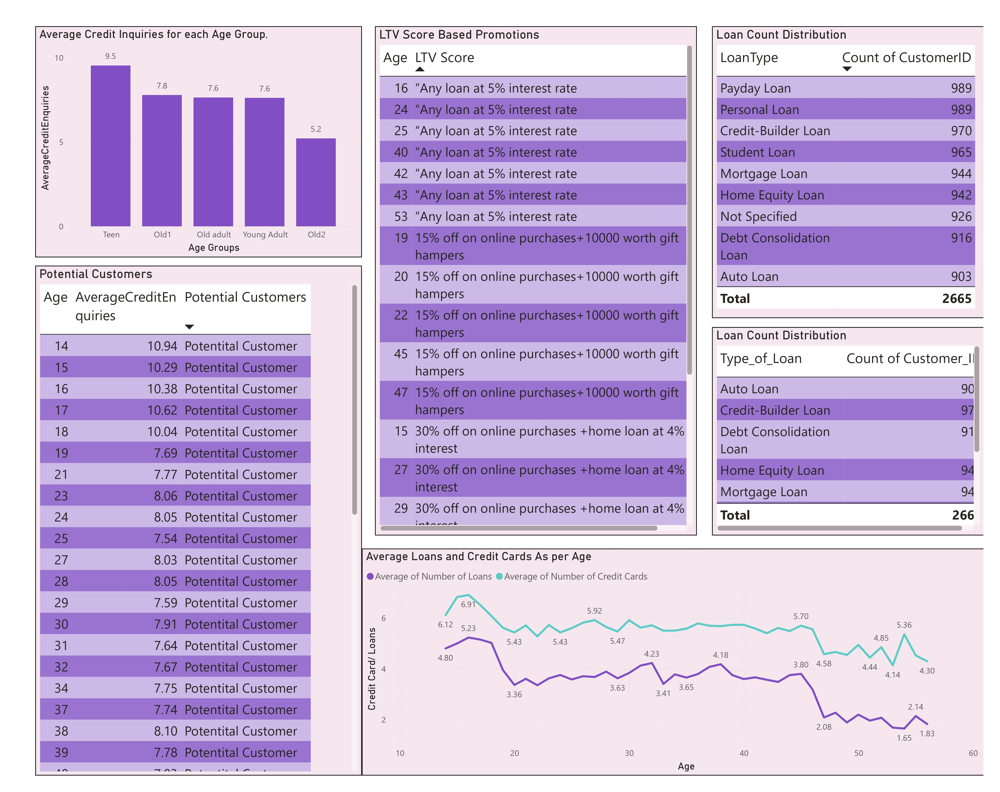

<h1 align="center">Automated Financial Reporting and Analytics Dashboard</h1>

## Overview
This project is an **end-to-end financial data automation and analytics solution** designed to streamline daily financial reporting and generate actionable business insights. The system processes multiple U.S. financial datasets received daily, automates data preparation, and delivers an interactive **Power BI dashboard** for stakeholder reporting and decision-making.

The project was built to solve a time-sensitive reporting challenge where multiple files had to be downloaded, cleaned, merged, analyzed, and shared within the same day.

---

## Dashboard Screenshots

### Dashboard Overview

### Customer, Credit Analysis, LTV and Loan Insights

---

## Problem Statement
The business received **25+ financial data files daily** from different survey teams. These files had to be:

- downloaded manually
- combined into a single dataset
- cleaned and standardized
- analyzed for insights
- converted into a dashboard/report
- shared with stakeholders before the reporting deadline

This manual workflow caused:

- high turnaround time
- increased risk of human error
- dependency on additional manpower
- higher operational cost
- delays affecting other business tasks

---

## Objective
The main objective of this project was to:

- automate the daily financial data workflow
- reduce manual reporting effort
- improve data accuracy and consistency
- generate KPI-based dashboards for business insights
- support faster and better decision-making

---

## Key Features
- Automated ETL pipeline for daily financial datasets
- Processing of **25+ daily U.S. financial files**
- Handling of **50K+ records**
- Data cleaning and transformation
- Power BI dashboard for financial analysis
- KPI tracking and trend analysis
- Customer segmentation and behavior analysis
- Automated report distribution using **Power Automate** and **Outlook**

---

## Tech Stack
- **Google Cloud Platform (GCP)** – data pipeline and processing
- **Power BI** – dashboarding and visualization
- **Power Automate** – workflow automation
- **Microsoft Outlook** – automated report distribution
- **Excel / CSV datasets** – source data files

---

## Workflow
### 1. Data Ingestion
Daily financial data files are received from multiple sources.

### 2. ETL Processing
The pipeline extracts, cleans, transforms, and consolidates the datasets into a usable format.

### 3. Data Analysis
The processed data is analyzed to identify trends, customer behavior, and business insights.

### 4. Dashboard Creation
A Power BI dashboard is built to visualize KPIs and support decision-making.

### 5. Report Automation
Reports are distributed automatically to stakeholders using Power Automate and Outlook.

---

## Dashboard KPIs
The dashboard includes 10+ financial and customer-related KPIs, such as:

- Average Annual Income
- Average Monthly Balance
- Average Delay in Payment
- Average Credit Utilization Ratio
- Age-wise Credit Limit Changes
- Payment Behavior by Credit Mix
- Customer Age Distribution
- Average Credit Inquiries by Age Group
- Average Loans and Credit Cards by Age
- Loan Type Distribution
- LTV-based Promotional Insights

---

## Business Impact
This project delivered measurable business value by:

- reducing manual reporting effort
- improving reporting speed and consistency
- minimizing data processing errors
- enabling same-day delivery of reports
- supporting data-driven financial and customer analysis
- improving operational efficiency

---

## Conclusion
The **Automated Financial Reporting and Analytics Dashboard** project demonstrates how automation and business intelligence can be combined to solve real-world reporting challenges. By integrating ETL automation, dashboard analytics, and report distribution, the project improves operational efficiency while delivering actionable financial insights.

---

